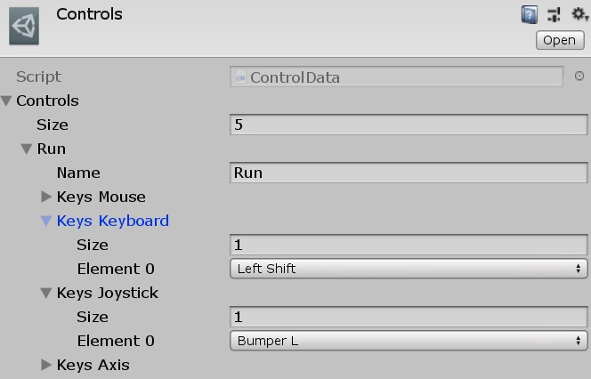

# Unity_Control

Version 0.3

Provides users a flawless controls with the ability to switch between any device such as a mouse, a keyboard, a xinput gamepad (including bluetooth) without changing any setting in the game.

Any control (like "Run", "Use" and so on) in a game can be assigned with any number of inputs simultaneously.

## Usage

```csharp
using FMLHT.Controls;

if (Control.IsControl("Run", State.Pressed) {
    //Run, Forrest!
}

Vector2 movement = Control.GetAxis("ArrowKeys");
var mouseMovement = Control.GetAxis("Mouse");
```

Also, using the [FMLHT Config extension](https://github.com/ismslv/Unity_CFG):

```ini
#name Controls.fmcfg

Control_Run_Keyboard = LeftSHift
Control_Run_Joystick = BumperL, ButtonA
```

```csharp
ControlData data;
data.Control("Run").keysKeyboard = CFG.AK("Control_Run_Keyboard");
data.Control("Run").keysJoystick = CFG.EK<Joystick>("Control_Run_Keyboard");
```

## Adding to a project
1. Add Control.cs to a GameObject
2. Create new ControlData asset
3. Assign asset to Control
4. Fill asset with named controls

    4.1. Supply control data to the asset

    4.2. Or list them in *.fmcfg and and add CFG extension

## TODO

Custom ties to a graphical user interface (a way to select controls)